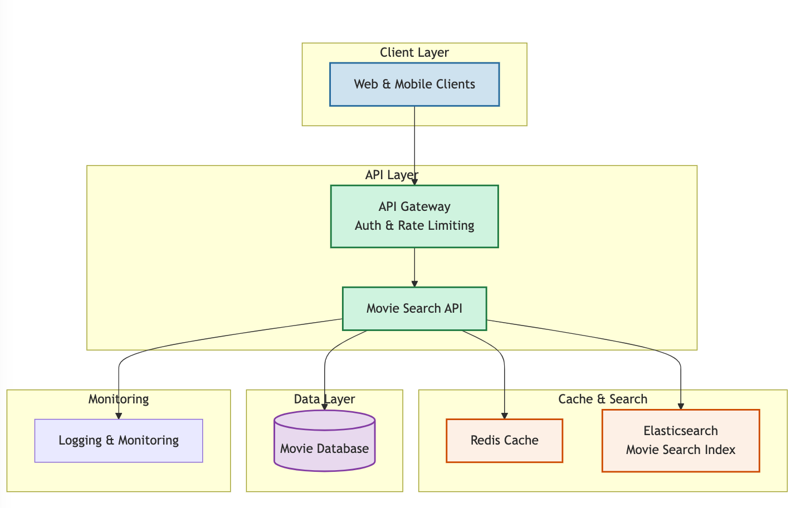

# Optix API


Tech test for Optix

Loosley based on [Dagable.Api](https://github.com/dagable/Dagable.Api) 

# Deployed

This is currently self hosted here: https://optix.jwm.xyz/swagger/index.html

```
curl "https://optix.jwm.xyz/Movies?title=Inception"
curl "https://optix.jwm.xyz/Movies?genre=Action"
curl "https://optix.jwm.xyz/Movies?title=A&genre=Horror"
curl "https://optix.jwm.xyz/Movies?genre=action&sortBy=voteaverage&orderBy=desc"
curl "https://optix.jwm.xyz/Movies?title=Matrix&genre=Action&sortBy=releaseDate&orderBy=asc&limit=10&page=1"
```

## Tech

### Tools
- Swagger - for API documentation
- Moq - for mocking in unit tests
- CSvHelper - For parsing CSV
- EntityFramework 

### Architecture

#### Optix.Api

- Masks any exceptions thrown anywhere within the application
	+ See `Optix.Api/Filters`
- Controller end points 
- Holds startup services and middleware registration
	+ Runs migrations on startup.

#### Optix.Api.Services

- Business Logic
- Interface between data access and API presentation layers
- Movie searching and other business logic is done here.
 - Depending on the data we could add some caching here.

#### Optix.DataAccess

- Data Access Layer
- Interacts with database 
- Used for changes within the database through code first EF

#### Optix.ErrorManagement

- Error/Exception handling 
- This ideally would be a standardised organisation package install via `Nuget` 
	+ Any specific errors would be loaded and injected
- This is really just a place holder, error logging etc would run through here. [See example](https://github.com/jwmxyz/DWS_CDR_API/blob/main/src/Cdr.ErrorManagementLibrary/CdrErrorManager.cs)
	
## Getting Started

### Prerequisites

- .Net 8
- Entity framework
	+ `dotnet tool install --global dotnet-ef`

### Setup 

- Clone this Repo
- Set the connection string.
- Navigate to `Optix.Api`
- Run `dotnet run`
- Swagger documentation will be `http://localhost:<port>/swagger/index.html`

### Improvements/Enhancements
- Add a useable UI (Sorry)
- Improved test cases and test coverage (unit/E2E/integration tests)
- Improve (or even add) Logging integration
- Improved Swagger documentation/examples inline with OAS

I would probably look at implementing something like the below:

<p align="center">
  
</p>
